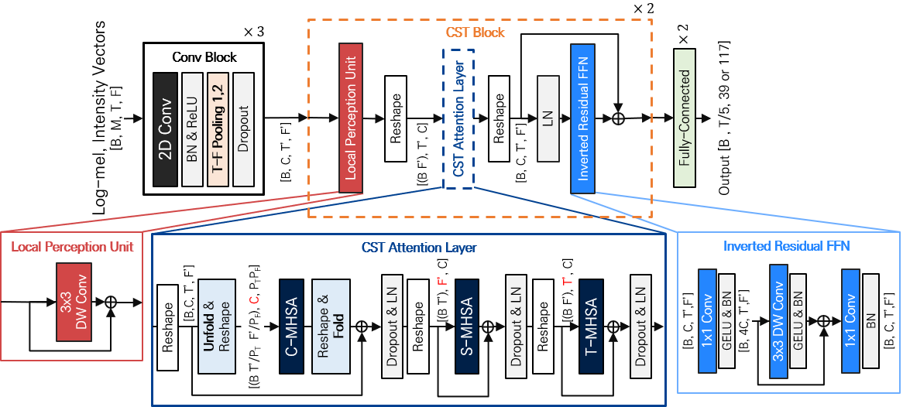

# CST-former: Transformer with Channel-Spectro-Temporal Attention  for Sound Event Localization and Detection
- Yusun Shul, Jung-Woo Choi*
- ICASSP 2024 Accepted

## Overview
### Architecture of audio-only CST-former for SELD
  
## Datasets
- The development dataset can be downloaded from the link. 
    - [Sony-TAu Realistic Spatial Soundscapes 2023 (STARSS23)](https://zenodo.org/record/7709052)
    - [Sony-TAu Realistic Spatial Soundscapes 2023 (STARSS22)](https://zenodo.org/records/6600531)
- Official Synthetic dataset can be downloaded from the link. 
    - [[DCASE2022 Task 3] Synthetic SELD mixtures for baseline training](https://zenodo.org/record/6406873#.ZEjVc3ZByUl)

## Getting Started
### Directory Structure
We recommend you to follow the below directory structure. foa_dev, metadata_dev, and video_dev are from the above link of zenodo.
```
DCASE_SELD                                   This repository.
├── data
|   └── 2023DCASE_data 
|       ├── foa_dev                          Ambisonic format, 24kHz, four channels.
|       |   ├── dev-test-sony
|       |   ├── dev-test-tau
|       |   ├── dev-train-sony
|       |   ├── dev-train-tau
|       |   ├── dev-train-synth-official
|       |   └── dev-train-synth-fsd50k-noisy <-- example naming of additional synthetic dataset
|       └── metadata_dev                     CSV format.
├── architecture
|   ├── CST_details
|   |   ├── CMT_Block.py                     LPU & IRFFN
|   |   ├── CST_encoder.py                   CST_attention / CST_encoder
|   |   ├── encoder.py                       Conv / SENet / ResNet Encoder
|   |   └── layers.py
|   └── CST_former_model.py                  CST_former
|   └── seldnet_model.py                     DCASE 2023 task3 baseline model
├── cls                                      We follow the metrics of challenge.
|   ├── cls_compute_seld_results.py
|   ├── cls_data_generator.py
|   ├── cls_feature_class.py
|   └── SELD_evaluation_metrics.py
├── utility                                 Utility defined for CST_former
├── preprocess.py                           Preprocess data
├── parameters.py                           Parameter setting
├── inference.py                            Inference for evaluation
└── train.py                                Train model                       
```

### Training Trial

1. Parameter Setting: ```parameters.py```
2. Preprocess audio data to log-mel spectrogram and intensity vector  ```  python3 preprocess.py <task-id> ```
  - The differences due to task-id for preprocessing are 
    - Label format
      - multi-accdoa : params['multi_accdoa'] = True at ```parameters.py```
      - single-accdoa : params['multi_accdoa'] = False at ```parameters.py```
3. Train CST-former
  - Additionally, you can add/change parameters by using a unique identifier task-id in if-else loop as seen in the parameter.py script and call them as following
  ```
  python3 train.py <task-id> <job-id>
  ```
  - Where job-id is a unique identifier that is used for output filenames (models, training plots). You can use any number or string for this.

4. Inference for evaluation
  ```   
  python3 inference.py <task-id> <job-id>
  ```

## Requirements
- pip install -r requirements
- pip install torch==2.0.0 torchvision==0.15.1 torchaudio==2.0.1 --index-url https://download.pytorch.org/whl/cu118
- pip install numpy==1.18.5
- conda install -c conda-forge libsndfile
